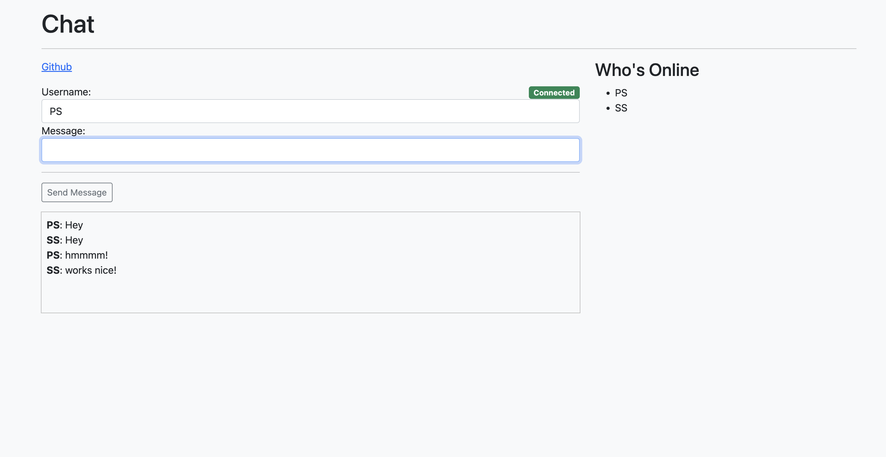

# Websocket - Golang

## Features

- Listens for requests to the home page and renders the HTML page.
- Added handler for WS connection upgrade along with a route.
- Added JS code for handling event listeners for sending messages to all users.
- WebSocket listener constantly listens for payloads and acts on them based on the action type:
  - **Broadcast Message:** Broadcast message to all online users.
  - **Remove User:** Delete user from online users when the user leaves the webpage.
  - **Add User:** Add user to the list of currently online users.

###### Note- Listens to port: 8080
